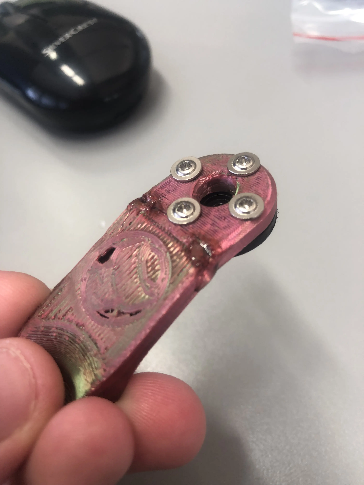

### Day 1 - 11/14/25
Found the files and started a rough planning of this project.

### Day 2 - 11/19/25
Not much progress, bc i watched the Hazbin Hotel S2 Finale
#### Day 2.1
started the 3d-print

### Day 3 - 11/28/25
Got the 3d-printed [Structural](Animatronic_Mouth_Download_Pack/STLs/Structural) parts and tried a rough assembly

### Day 4 - 12/03/25
Created this repo and set up everything to start coding.
#### Day 4.1
Servos, bearings and servo-driver ordered, awaiting delivery
#### Day 4.2
Everything arrived, exept 2 big servos, which will be needed for the attachment of the lower jaw to the rest.

### Day 5 - 12/12/25
Assembly of the smaller servos to the main parts, accidentally broke and fixed a few pieces. i will never show what it looks like inside, it looks like a fire broke out
#### Day 5.1 
Bigger servos ordered

### Day 6 - 12/17/25
Writing this documentation and celebrating christmas
#### Day 6.1
Assembled most of the small servos
#### Day 6.2
Bought new screws to secure the big servos to connect the lower jaw
#### Day 6.3
Glued Servos to the 3D-printed structural parts

### Day 7 - 01/09/26
Tested the servos and created [the jaw tester](code/two_servo_async/two_servo_async.ino) and ran into troubles with Servo0/Servo-Right. Its one of the big ones and it seems to be broken, as it stutteres and heats up the MOSFETs on my 5V PSU to a dangerously high temperature.

### Day 8 - 01/14/26
While unpacking, i noticed that the [left jaw connector](Animatronic_Mouth_Download_Pack/STLs/Structural/Jaw%20Linkage%20Right.stl) was broken below the lower screwhole. I fixed it with some superglue, but its still annoying.
    

        
image of the broken part

        
    

